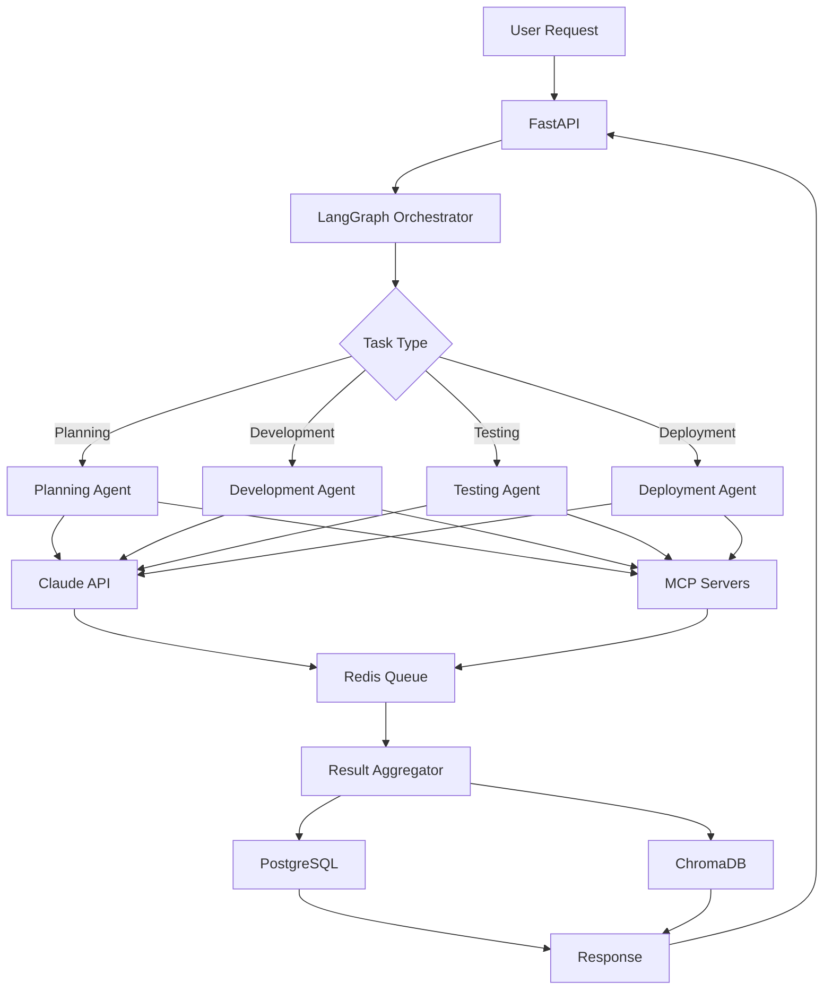

# 에이전틱 개발 파이프라인 기술 구현 계획

## 📋 목차
1. [기술 스택 개요](#기술-스택-개요)
2. [핵심 기술 동향 분석](#핵심-기술-동향-분석)
3. [시스템 아키텍처](#시스템-아키텍처)
4. [구현 계획](#구현-계획)
5. [통합 전략](#통합-전략)

## 기술 스택 개요

### 🔥 Core Stack (최종 선정)
| 기술 | 역할 | 선정 이유 |
|------|------|----------|
| **LangGraph** | 워크플로우 오케스트레이션 | 2025년 최신 기능: 노드 캐싱, 지연 실행, 멀티에이전트 지원 |
| **Python 3.11+** | 메인 런타임 | AI/ML 생태계 최적화, 타입 힌팅 개선 |
| **Redis** | 큐/스트림/캐시/세션 | 통합 인메모리 솔루션, Redis Streams 활용 |
| **PostgreSQL** | 메타데이터 저장 | JSONB 지원, 관계형 데이터 처리 |
| **ChromaDB** | 벡터 저장소 | 벡터 검색 성능, AI 생태계 호환성 |
| **FastAPI** | API 서버 | 비동기 처리, 자동 문서화, 타입 안전성 |

### 🤖 AI/Integration
- **Claude API** - 메인 LLM (Opus 4)
- **MCP (Model Context Protocol)** - Claude Code 통합

### 🏗️ Infrastructure
- **Docker** - 컨테이너화
- **Kubernetes** - 오케스트레이션
- **Prometheus + Grafana** - 모니터링
- **Sentry** - 에러 추적

## 핵심 기술 동향 분석

### 1. LangGraph (2025년 최신)

#### 주요 기능
- **노드 캐싱**: 반복적인 계산 최소화로 개발 속도 향상
- **지연 노드(Deferred Nodes)**: map-reduce, 합의 알고리즘 지원
- **Pre/Post 모델 훅**: 컨텍스트 제어, 가드레일 적용
- **내장 프로바이더 도구**: 웹 검색, RemoteMCP 기본 제공

#### 멀티에이전트 시스템
```python
# Send API를 활용한 오케스트레이터-워커 패턴
class SupervisorAgent:
    def __init__(self):
        self.graph = StateGraph(State)
        
    async def orchestrate(self, task):
        # 동적으로 워커 노드 생성
        workers = self.create_workers(task)
        # 각 워커에 특정 입력 전송
        results = await self.send_to_workers(workers, task)
        # 공유 상태 키에 결과 작성
        return self.aggregate_results(results)
```

### 2. MCP (Model Context Protocol)

#### 2025년 업데이트
- **다중 전송 지원**: stdio, WebSockets, HTTP SSE, UNIX sockets
- **Streamable HTTP**: 서버리스 환경 최적화 (Cloud Run 지원)
- **리소스 관리**: @ 멘션을 통한 리소스 참조
- **스코프 관리**: 프로젝트/사용자/시스템 레벨 설정

#### Claude Code 통합
```bash
# MCP 서버 추가
claude mcp add my-server -e API_KEY=123 -- /path/to/server arg1 arg2

# Claude Desktop 연결 설정
{
  "command": "claude",
  "args": ["mcp", "serve"],
  "env": {}
}
```

## 시스템 아키텍처

### 1. 계층형 아키텍처

```
┌─────────────────────────────────────────────────────────────┐
│                    API Layer (FastAPI)                       │
│  - REST API Endpoints                                        │
│  - WebSocket for Real-time Updates                          │
│  - MCP Server Integration                                    │
├─────────────────────────────────────────────────────────────┤
│               Orchestration Layer (LangGraph)                │
│  - Workflow Engine                                           │
│  - Agent Coordinator                                         │
│  - State Management                                          │
├─────────────────────────────────────────────────────────────┤
│                    Agent Layer                               │
│  ┌──────────┐ ┌──────────┐ ┌──────────┐ ┌──────────┐      │
│  │Planning  │ │Development│ │Testing   │ │Deployment│      │
│  │Agent     │ │Agent      │ │Agent     │ │Agent     │      │
│  └──────────┘ └──────────┘ └──────────┘ └──────────┘      │
├─────────────────────────────────────────────────────────────┤
│                 Integration Layer                            │
│  - Claude API Client                                         │
│  - MCP Clients (GitHub, Docker, etc.)                       │
│  - Tool Adapters                                            │
├─────────────────────────────────────────────────────────────┤
│                  Storage Layer                               │
│  ┌──────────┐ ┌──────────┐ ┌──────────┐                   │
│  │PostgreSQL│ │Redis     │ │ChromaDB  │                   │
│  │(Metadata)│ │(Queue)   │ │(Vectors) │                   │
│  └──────────┘ └──────────┘ └──────────┘                   │
└─────────────────────────────────────────────────────────────┘
```

### 2. 데이터 플로우



## 구현 계획

### Phase 1: 기반 인프라 (2주)

#### 1.1 프로젝트 구조 설정
```
agentic-dev-pipeline/
├── src/
│   ├── api/                  # FastAPI 애플리케이션
│   │   ├── __init__.py
│   │   ├── main.py
│   │   ├── routes/
│   │   └── middleware/
│   ├── orchestration/        # LangGraph 워크플로우
│   │   ├── __init__.py
│   │   ├── graphs/
│   │   ├── nodes/
│   │   └── state.py
│   ├── agents/              # AI 에이전트
│   │   ├── __init__.py
│   │   ├── base.py
│   │   ├── planning/
│   │   ├── development/
│   │   ├── testing/
│   │   └── deployment/
│   ├── integrations/        # 외부 서비스 통합
│   │   ├── claude_client.py
│   │   ├── mcp_client.py
│   │   └── tools/
│   └── storage/            # 데이터 저장소
│       ├── postgres.py
│       ├── redis_client.py
│       └── chroma_client.py
```

#### 1.2 기본 설정 및 환경
```python
# src/config.py
from pydantic_settings import BaseSettings

class Settings(BaseSettings):
    # API Keys
    anthropic_api_key: str
    
    # Database
    postgres_url: str
    redis_url: str
    chroma_host: str
    
    # LangGraph
    langgraph_api_key: str
    langgraph_platform_url: str
    
    # MCP
    mcp_server_configs: dict
    
    class Config:
        env_file = ".env"
```

### Phase 2: 핵심 컴포넌트 구현 (3주)

#### 2.1 LangGraph 워크플로우 엔진
```python
# src/orchestration/graphs/main_workflow.py
from langgraph.graph import StateGraph, END
from langgraph.prebuilt import ToolExecutor
from typing import TypedDict, Annotated, Sequence
import operator

class WorkflowState(TypedDict):
    messages: Annotated[Sequence[BaseMessage], operator.add]
    task_type: str
    project_context: dict
    results: dict
    status: str

class MainWorkflow:
    def __init__(self):
        self.graph = StateGraph(WorkflowState)
        self._setup_nodes()
        self._setup_edges()
        
    def _setup_nodes(self):
        # 노드 정의
        self.graph.add_node("analyze_task", self.analyze_task)
        self.graph.add_node("planning", self.planning_node)
        self.graph.add_node("development", self.development_node)
        self.graph.add_node("testing", self.testing_node)
        self.graph.add_node("deployment", self.deployment_node)
        self.graph.add_node("monitoring", self.monitoring_node)
        
    def _setup_edges(self):
        # 조건부 엣지 설정
        self.graph.add_conditional_edges(
            "analyze_task",
            self.route_task,
            {
                "planning": "planning",
                "development": "development",
                "hotfix": "hotfix_flow"
            }
        )
        
    async def analyze_task(self, state: WorkflowState):
        """태스크 분석 및 라우팅"""
        # Claude API를 사용하여 태스크 분석
        pass
        
    async def planning_node(self, state: WorkflowState):
        """Planning Agent 실행"""
        from src.agents.planning import PlanningAgent
        agent = PlanningAgent()
        result = await agent.execute(state)
        return {"results": result}
```

#### 2.2 에이전트 베이스 클래스
```python
# src/agents/base.py
from abc import ABC, abstractmethod
from typing import Dict, Any, List
from langchain_anthropic import ChatAnthropic
from langgraph.prebuilt import create_react_agent

class BaseAgent(ABC):
    """모든 에이전트의 베이스 클래스"""
    
    def __init__(self, name: str):
        self.name = name
        self.llm = ChatAnthropic(
            model="claude-3-opus-20240229",
            temperature=0.1
        )
        self.tools = self._get_tools()
        self.agent = self._create_agent()
        
    @abstractmethod
    def _get_tools(self) -> List[Any]:
        """에이전트별 도구 정의"""
        pass
        
    @abstractmethod
    def _get_system_prompt(self) -> str:
        """에이전트별 시스템 프롬프트"""
        pass
        
    def _create_agent(self):
        """ReAct 에이전트 생성"""
        return create_react_agent(
            self.llm,
            self.tools,
            messages_modifier=self._get_system_prompt()
        )
        
    async def execute(self, state: Dict[str, Any]) -> Dict[str, Any]:
        """에이전트 실행"""
        result = await self.agent.ainvoke(state)
        return self._process_result(result)
        
    @abstractmethod
    def _process_result(self, result: Any) -> Dict[str, Any]:
        """결과 후처리"""
        pass
```

#### 2.3 MCP 통합
```python
# src/integrations/mcp_client.py
import asyncio
from typing import Dict, Any
import httpx

class MCPClient:
    """Model Context Protocol 클라이언트"""
    
    def __init__(self, config: Dict[str, Any]):
        self.config = config
        self.servers = {}
        self._initialize_servers()
        
    def _initialize_servers(self):
        """MCP 서버 초기화"""
        for name, server_config in self.config.items():
            self.servers[name] = MCPServer(
                name=name,
                command=server_config['command'],
                args=server_config.get('args', []),
                env=server_config.get('env', {})
            )
            
    async def call_tool(self, server: str, tool: str, params: Dict[str, Any]):
        """MCP 도구 호출"""
        if server not in self.servers:
            raise ValueError(f"Unknown MCP server: {server}")
            
        return await self.servers[server].call_tool(tool, params)

class MCPServer:
    """개별 MCP 서버 인스턴스"""
    
    def __init__(self, name: str, command: str, args: List[str], env: Dict[str, str]):
        self.name = name
        self.command = command
        self.args = args
        self.env = env
        self.process = None
        
    async def start(self):
        """서버 프로세스 시작"""
        self.process = await asyncio.create_subprocess_exec(
            self.command,
            *self.args,
            env={**os.environ, **self.env},
            stdout=asyncio.subprocess.PIPE,
            stderr=asyncio.subprocess.PIPE
        )
```

### Phase 3: 에이전트 구현 (3주)

#### 3.1 Planning Agent
```python
# src/agents/planning/agent.py
from src.agents.base import BaseAgent
from src.integrations.mcp_client import MCPClient

class PlanningAgent(BaseAgent):
    """요구사항 분석 및 계획 수립 에이전트"""
    
    def __init__(self):
        super().__init__("PlanningAgent")
        self.mcp_client = MCPClient(config.mcp_server_configs)
        
    def _get_tools(self):
        return [
            self.analyze_requirements,
            self.create_architecture,
            self.estimate_timeline,
            self.identify_risks
        ]
        
    def _get_system_prompt(self):
        return """You are a Planning Agent responsible for:
        1. Analyzing project requirements
        2. Creating system architecture
        3. Estimating timelines
        4. Identifying risks and dependencies
        
        Always provide structured outputs with clear documentation."""
        
    async def analyze_requirements(self, requirements: str):
        """요구사항 분석"""
        # Claude API를 사용한 상세 분석
        response = await self.llm.ainvoke([
            {"role": "system", "content": self._get_system_prompt()},
            {"role": "user", "content": f"Analyze these requirements: {requirements}"}
        ])
        
        # 결과를 ChromaDB에 저장
        await self._store_in_vector_db(response)
        
        return response
```

#### 3.2 Development Agent
```python
# src/agents/development/agent.py
class DevelopmentAgent(BaseAgent):
    """코드 생성 및 구현 에이전트"""
    
    def _get_tools(self):
        return [
            self.generate_code,
            self.create_tests,
            self.setup_infrastructure,
            self.integrate_apis
        ]
        
    async def generate_code(self, spec: Dict[str, Any]):
        """코드 생성"""
        # MCP를 통한 파일 시스템 접근
        await self.mcp_client.call_tool(
            "filesystem",
            "create_file",
            {"path": spec['file_path'], "content": generated_code}
        )
```

### Phase 4: 통합 및 배포 (2주)

#### 4.1 FastAPI 서버
```python
# src/api/main.py
from fastapi import FastAPI, WebSocket
from fastapi.middleware.cors import CORSMiddleware
from src.orchestration.graphs.main_workflow import MainWorkflow

app = FastAPI(title="Agentic Development Pipeline")

# CORS 설정
app.add_middleware(
    CORSMiddleware,
    allow_origins=["*"],
    allow_methods=["*"],
    allow_headers=["*"],
)

# 워크플로우 인스턴스
workflow = MainWorkflow()

@app.post("/pipeline/execute")
async def execute_pipeline(request: PipelineRequest):
    """파이프라인 실행"""
    result = await workflow.execute(request.dict())
    return {"task_id": result["task_id"], "status": "started"}

@app.websocket("/pipeline/status/{task_id}")
async def pipeline_status(websocket: WebSocket, task_id: str):
    """실시간 상태 업데이트"""
    await websocket.accept()
    
    # Redis 스트림에서 상태 구독
    async for update in redis_client.subscribe(f"pipeline:{task_id}"):
        await websocket.send_json(update)
```

#### 4.2 Docker 구성
```dockerfile
# Dockerfile
FROM python:3.11-slim

WORKDIR /app

# 시스템 의존성
RUN apt-get update && apt-get install -y \
    build-essential \
    git \
    && rm -rf /var/lib/apt/lists/*

# Python 의존성
COPY requirements.txt .
RUN pip install --no-cache-dir -r requirements.txt

# 애플리케이션 코드
COPY src/ ./src/
COPY configs/ ./configs/

# MCP 서버 설정
COPY .claude/ ./.claude/

CMD ["uvicorn", "src.api.main:app", "--host", "0.0.0.0", "--port", "8000"]
```

## 통합 전략

### 1. Claude Code와의 통합

#### MCP 서버 구성
```json
// .claude/mcp.json
{
  "mcpServers": {
    "pipeline-controller": {
      "command": "python",
      "args": ["src/mcp_servers/pipeline_server.py"],
      "env": {
        "PIPELINE_API_URL": "http://localhost:8000"
      }
    },
    "code-generator": {
      "command": "python",
      "args": ["src/mcp_servers/code_server.py"]
    }
  }
}
```

#### Slash Commands 통합
```markdown
# .claude/commands/execute-pipeline.md
# 파이프라인 실행

다음을 수행해줘:

1. MCP를 통해 파이프라인 서버에 연결
2. 프로젝트 요구사항 전달: $ARGUMENTS
3. 실행 상태 모니터링
4. 결과 보고

사용할 MCP 서버: pipeline-controller
```

### 2. 모니터링 및 관찰성

#### Prometheus 메트릭
```python
# src/monitoring/metrics.py
from prometheus_client import Counter, Histogram, Gauge

# 메트릭 정의
pipeline_executions = Counter('pipeline_executions_total', 'Total pipeline executions')
pipeline_duration = Histogram('pipeline_duration_seconds', 'Pipeline execution duration')
active_agents = Gauge('active_agents', 'Number of active agents')

# LangSmith 통합
from langsmith import Client
langsmith_client = Client()
```

### 3. 보안 고려사항

- **API 키 관리**: HashiCorp Vault 또는 AWS Secrets Manager 사용
- **MCP 서버 인증**: OAuth 2.0 기반 인증
- **네트워크 격리**: 에이전트별 네트워크 세그먼트
- **감사 로깅**: 모든 에이전트 활동 기록

## 다음 단계

1. **MVP 구현** (4주)
   - 기본 워크플로우 엔진
   - Planning & Development Agent
   - Claude API 통합

2. **확장 구현** (4주)
   - 나머지 에이전트
   - MCP 서버 전체 통합
   - 모니터링 대시보드

3. **프로덕션 준비** (2주)
   - 성능 최적화
   - 보안 강화
   - 문서화 완성

총 예상 기간: **10주**